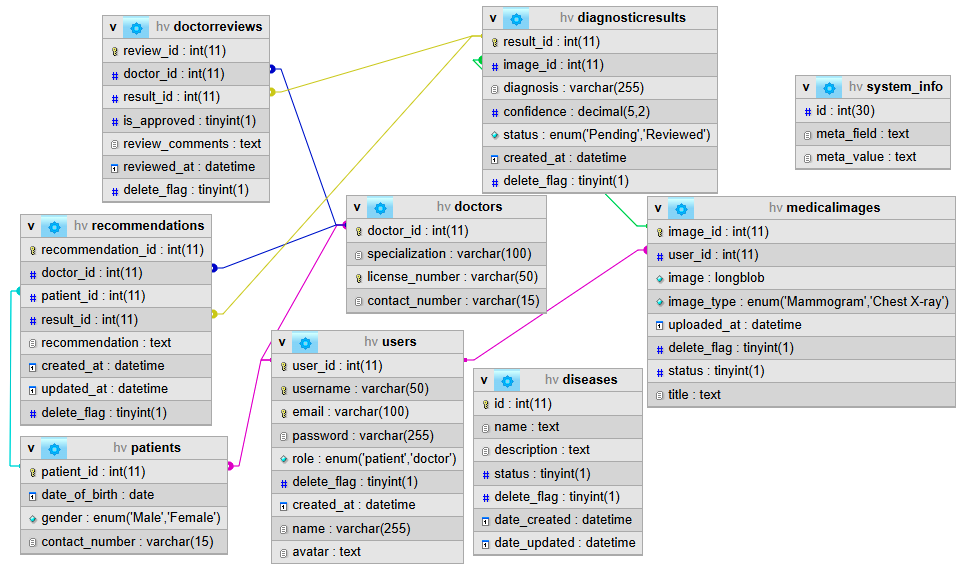
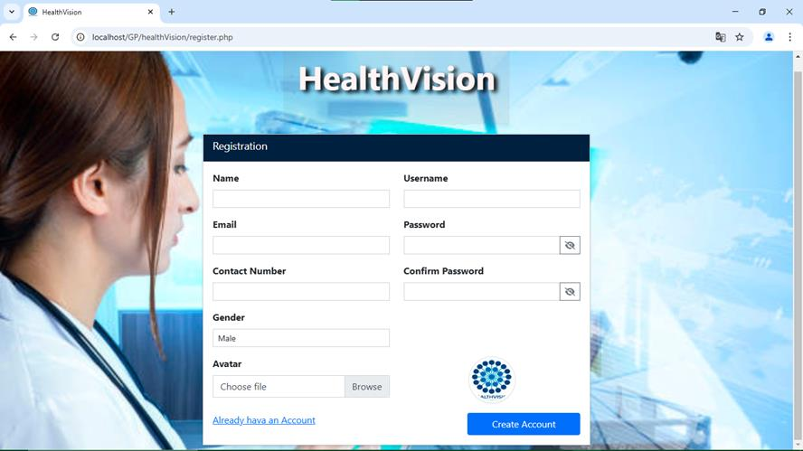
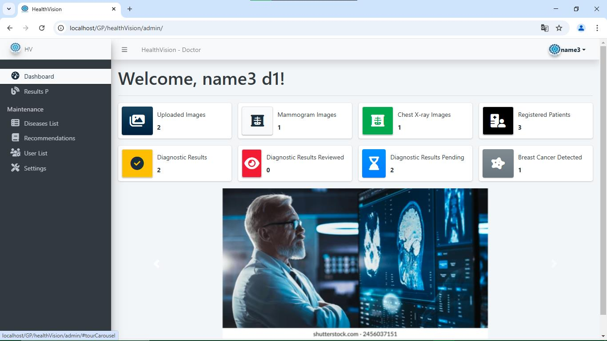
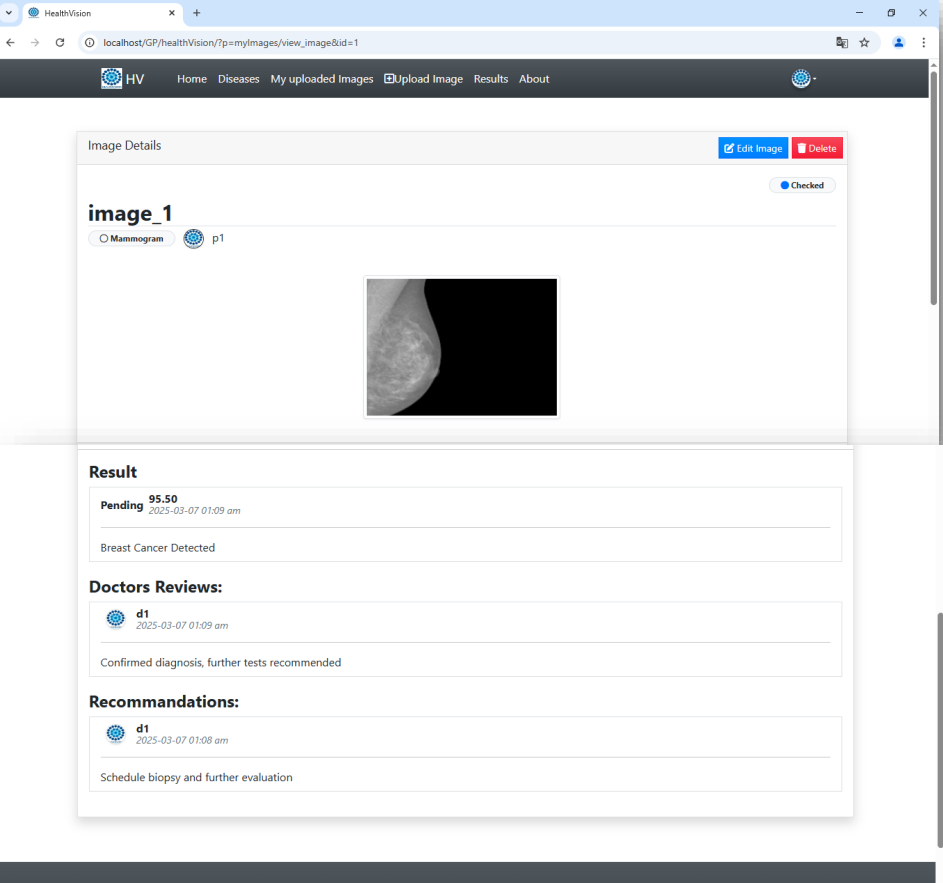

# HealthVision

A web-based intelligent platform for automated medical image analysis and disease diagnosis using deep learning. HealthVision streamlines the detection of pneumonia and breast cancer from X-ray and mammogram images, providing an end-to-end workflow from image upload to AI-driven diagnosis, doctor review, and actionable recommendations.

---

## Table of Contents

* Features
* System Architecture
* Integrated AI Models
* Screenshots
* Database Schema
* Installation & Deployment
* Usage Guide
* Project Structure
* License

---

## Features

* Upload and analyze medical images (Mammograms & Chest X-rays)
* Automated disease detection using state-of-the-art deep learning models
* Role-based access for doctors and patients
* Doctors can review AI diagnoses, confirm, comment, and provide recommendations
* Secure user registration and authentication
* Audit trail for all actions (uploads, reviews, recommendations)
* Comprehensive dashboard with statistics and image management
* Clean and intuitive web interface

---

## System Architecture

* **Frontend:** Responsive web interface (HTML/CSS/JS, Bootstrap)
* **Backend:** PHP-based RESTful API
* **Database:** MySQL relational database (see schema below)
* **AI Integration:** Python-based ML models (REST API or batch inference)
* **Security:** User authentication, access control, and data validation

---

## Integrated AI Models

1. **Chest X-ray Pneumonia Detector**
   Detects pneumonia from chest X-ray images using a convolutional neural network.
   [Source Code & Details](https://github.com/sa1ah-ai/chest-xray-pneumonia-detector)

2. **Breast Cancer Mammogram Classification**
   Identifies malignant and non-malignant breast tumors from mammogram images.
   [Source Code & Details](https://github.com/sa1ah-ai/breast-cancer-mammogram-classification)

---

## Screenshots

### 1. Database Schema



### 2. Registration Page



### 3. Doctor Dashboard



### 4. Image Details after Analysis



---

## Database Schema

The system uses a normalized MySQL database with the following key tables:

* `users`: Stores credentials, roles (patient/doctor), and profile info.
* `patients`: Patient-specific demographics.
* `doctors`: Doctor credentials and specialization.
* `medicalimages`: Uploaded images and metadata.
* `diagnosticresults`: Model-generated diagnoses and status.
* `doctorreviews`: Doctor confirmation and comments on results.
* `recommendations`: Doctor recommendations for patient care.
* `diseases`: Disease definitions and metadata.
* `system_info`: Miscellaneous system-level data.

For details, see the [Database Schema Screenshot](#database-schema).

---

## Installation & Deployment

> **Note:** This project is provided as a research/development prototype. Adapt paths, credentials, and security settings before production deployment.

### Prerequisites

* Apache/Nginx web server with PHP 8.x
* MySQL 5.7+/MariaDB
* Python 3.x (for ML model inference API)
* `pip install` required Python dependencies (see each model repo)

### Steps

1. **Clone the Repository**

   ```bash
   git clone https://github.com/sa1ah-ai/healthVision.git
   ```

2. **Setup Database**

   * Import the provided SQL schema (`database.sql`) into your MySQL server.

3. **Configure Backend**

   * Set database connection in `/config/db.php`
   * Update file upload and API integration settings in `/config/`

4. **Deploy ML Models**

   * Deploy or serve the two AI models (see linked repos above).
   * Configure API endpoints in backend for inference.

5. **Start Web Server**

   * Launch the application from your localhost or production server.

---

## Usage Guide

1. **Registration**

   * Patients and doctors can register with email, password, contact number, gender, and avatar.

2. **Image Upload**

   * Users upload mammogram or chest X-ray images.
   * System automatically sends images to AI models for inference.

3. **Diagnosis & Results**

   * View results (e.g., "Breast Cancer Detected") with confidence scores.
   * Doctors review, confirm, and provide recommendations for each case.

4. **Dashboard & Tracking**

   * Doctors: View all uploaded images, results, patient list, and pending reviews.
   * Patients: Track personal image history, diagnosis, and doctor feedback.

---

## Project Structure

```
healthVision/
│
├── admin/                # Admin/Doctor dashboards and panels
├── config/               # Configuration files (DB, API endpoints)
├── images/               # Uploaded image assets
├── sys_screenshots/      # System screenshots for documentation
├── src/                  # Core PHP source code (business logic)
├── templates/            # HTML templates and static files
├── README.md             # This file
└── ...                   # Other assets, scripts, docs
```

---

## License

This project is released under the MIT License for academic and research purposes. Use at your own risk.
